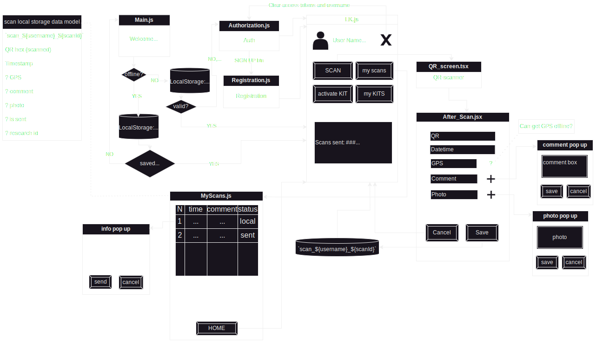

# BioKeeper frontend react native
---------------------------------
# Install 
```sh
git clone https://github.com/Mityamops/biokeeper-frontend.git
cd biokeeper-frontend
npm i -g expo-cli
npm install
npm start
```

# components


filename   | description of file
----------------------|----------------------
Main.js            | welcome window
Autorization.js     | Autorization
LK.js               |personal account, list of research
ResearchComment.jsx    | information about the research
QR_screen.tsx          | window for scanning the QR code of the research
After_Scan.jsx           | a window where information is read, such as    geolocation, date and time of the research, and a request is sent to the server, you can also take a photo of the sample from this window
Take_photo.tsx         | the window from which the sample photo is taken
Registration.js        | this window is used to "create" new user and save it to database
Authfunc.js            | a handmade module to simply make axios requests with different endpoints the same way
MyScans.js             | a table is created in which all saved scans are loaded from the storage